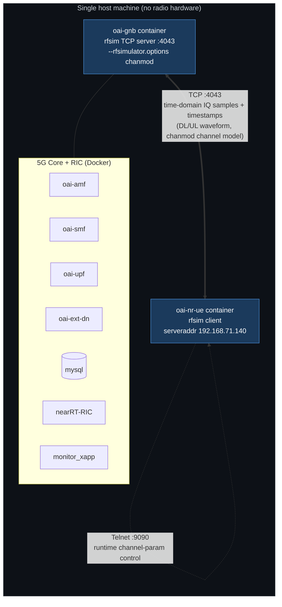
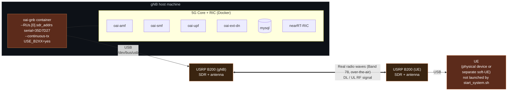
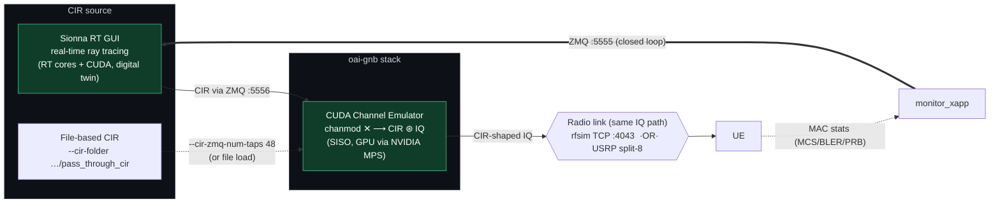

# `start_system.sh rfsim` vs `start_system.sh b200`

두 모드의 차이를 정리한 문서. 아래 Mermaid 다이어그램을 클로드(또는 GitHub/mermaid.live)에 넣으면 그림으로 렌더링된다.

## 한눈에 보는 차이

| 항목 | `rfsim` | `b200` |
|------|---------|--------|
| `.env` | `config/rfsim/.env` | `config/b200/.env` |
| `USE_B2XX` | `no` | `yes` |
| 무선 구간 | **TCP 소켓**으로 IQ 샘플 교환 | **실제 전파** (USRP B200 SDR) |
| gNB RF 옵션 | `--rfsim --rfsimulator.options chanmod` | `--RUs.[0].sdr_addrs serial=... --continuous-tx` |
| UE RF 옵션 | `--rfsim --rfsimulator.serveraddr 192.168.71.140` | `--usrp-args serial=... --ue-fo-compensation --band 78` |
| UE 컨테이너 | `start_system.sh`가 **직접 기동** (`oai-nr-ue`) | **기동 안 함** — 별도 물리 UE / 별도 soft-UE |
| 필요 하드웨어 | 없음 (GPU만) | USRP B200 × (gNB용, UE용) + 안테나 |
| 채널 모델 | `chanmod` (소프트웨어) | 실제 무선 채널 |
| 제어 채널 | Telnet `:9090` (chanmod 런타임 조정) | 해당 없음 |

핵심: **rfsim은 안테나/전파를 TCP 소켓으로 대체**하고, **b200은 실제 USRP SDR로 전파를 쏜다.**

---

## 다이어그램: rfsim 모드

## 다이어그램: b200 모드

## 다이어그램: Sionna-RK 채널 에뮬레이션 (chanmod 교체)

Sionna-RK는 gNB 스택 안의 **CUDA Channel Emulator** 플러그인으로 OAI 기본 `chanmod`를
site-specific **CIR(채널 임펄스 응답)** 적용으로 교체한다. rfsim·b200 두 모드 모두에서 동작한다.

**핵심:** 에뮬레이터는 mode-agnostic — rfsim 소켓이든 b200 USRP든 동일하게 CIR로 가공된 IQ를
흘려보내, 시뮬레이션과 실제 RF 사이에 일관된 digital-twin 채널 조건을 만든다.
`config/<mode>/.env`의 `GNB_EXTRA_OPTIONS`로 활성화한다.

---

## 공통점

두 모드 모두 **PHY 계층 위쪽(MAC/RLC/PDCP/RRC/NAS)과 5G Core는 완전히 동일**하게 동작한다.
오직 "안테나에서 나가기 직전의 물리 무선 구간"만 다르다:

- `rfsim` → IQ 샘플을 TCP로 스트리밍 (소프트웨어 채널)
- `b200` → IQ 샘플을 USRP DAC/ADC로 변환해 실제 전파 송수신

> **참고:** 이 그림을 다시 그리고 싶으면 위 Mermaid 블록을 클로드에게 주면서
> "이 Mermaid 다이어그램을 렌더링해줘" 또는 "이 내용으로 그림 그려줘"라고 요청하면 된다.
