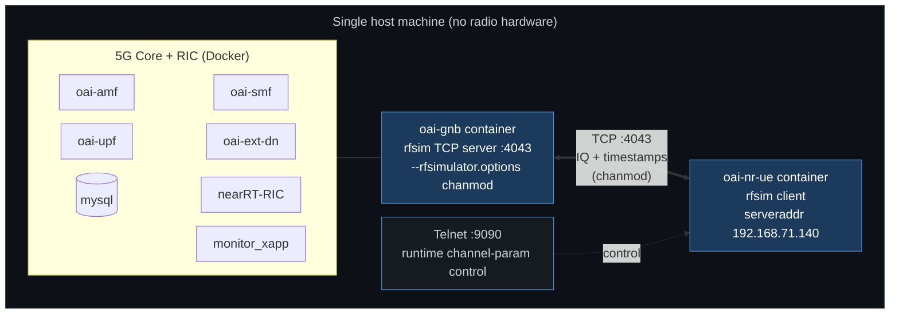
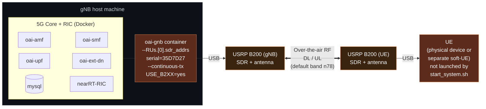
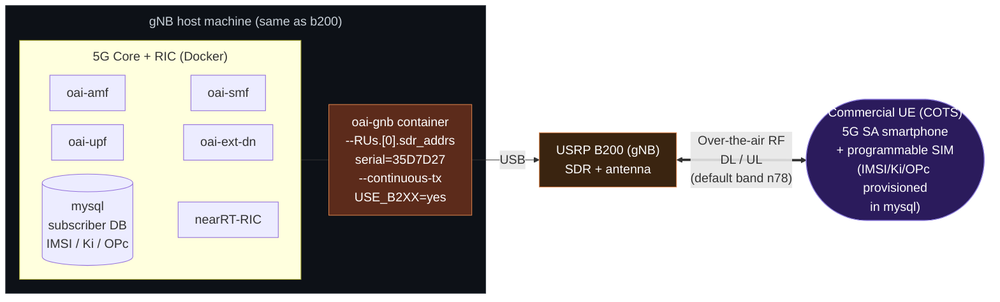
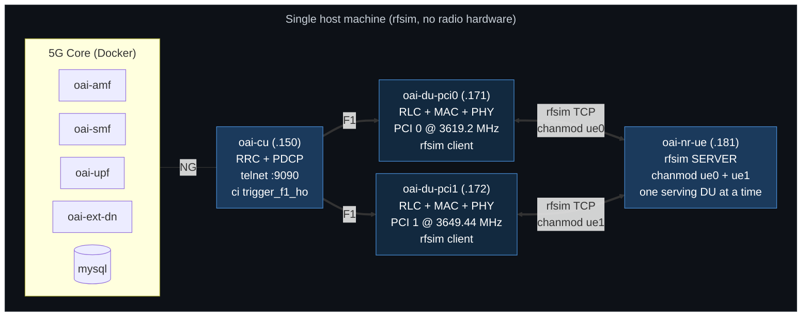
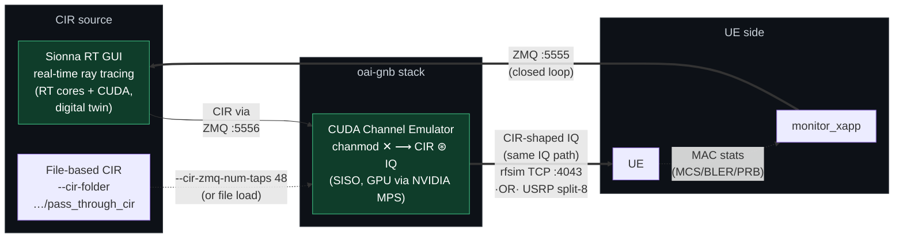

# `start_system.sh` 모드: `rfsim` · `b200` · `ho`

`./scripts/start_system.sh [rfsim|b200|ho]`의 세 모드를 정리한 문서.
아래 Mermaid 다이어그램을 클로드(또는 GitHub/mermaid.live)에 넣으면 그림으로 렌더링된다.

## 한눈에 보는 차이

| 항목 | `rfsim` | `b200` | `ho` |
|------|---------|--------|------|
| 기동 | `start_system.sh rfsim` (기본값) | `start_system.sh b200` | `start_system.sh ho` → `config/rfsim-ho/start_handover.sh up`으로 위임 |
| RAN 컨테이너 | 단일 `oai-gnb` | 단일 `oai-gnb` | `oai-cu` + `oai-du-pci0` + `oai-du-pci1` |
| `.env` | `config/rfsim/.env` | `config/b200/.env` | `config/rfsim-ho/.env` |
| `USE_B2XX` | `no` | `yes` | `no` |
| 무선 구간 | **TCP 소켓**으로 IQ 샘플 교환 | **실제 전파** (USRP B200 SDR) | **TCP 소켓** — 단, **서버가 UE**이고 두 DU가 클라이언트 |
| gNB RF 옵션 | `--rfsim --rfsimulator.options chanmod` | `--RUs.[0].sdr_addrs serial=... --continuous-tx` | DU: `--rfsim --rfsimulator.options chanmod --rfsimulator.serveraddr 192.168.71.181` (CU는 PHY 없음) |
| UE RF 옵션 | `--rfsim --rfsimulator.serveraddr 192.168.71.140` | `--usrp-args serial=... --ue-fo-compensation --band 78` | `--rfsim --rfsimulator.serveraddr server` (+ `-r 106 --numerology 1 -C 3619200000 --ssb 516`) |
| UE 컨테이너 | `start_system.sh`가 **직접 기동** (`oai-nr-ue`) | **기동 안 함** — 별도 물리 UE / 별도 soft-UE | **직접 기동** (`oai-nr-ue`, rfsim 서버 역할) |
| 필요 하드웨어 | 없음 (GPU만) | gNB용 USRP B200 + 안테나, UE 쪽은 **USRP B200 + soft-UE** 또는 **상용 단말(COTS UE)** | 없음 (GPU만) |
| 채널 모델 | `chanmod` (소프트웨어) | 실제 무선 채널 | `chanmod` 2개 (`rfsimu_channel_ue0` / `ue1`) |
| RIC / xApp | `nearRT-RIC` + `monitor_xapp` | `nearRT-RIC` | 없음 |
| 제어 채널 | Telnet `:9090` (chanmod 런타임 조정) | 해당 없음 | CU Telnet `:9090` (`ci trigger_f1_ho`), UE Telnet `:8091` |
| 핸드오버 | 없음 | 없음 | **intra-CU F1**, 수동 트리거 |

핵심: **rfsim은 안테나/전파를 TCP 소켓으로 대체**하고, **b200은 실제 USRP SDR로 전파를 쏜다.**
**ho는 rfsim을 그대로 쓰되 gNB를 CU + 2×DU로 쪼개** 셀 간 F1 핸드오버를 재현한다.

> `rfsim`/`b200`(단일 gNB)과 `ho`(CU+2×DU)는 같은 네트워크(`oai-public-net`)와 컨테이너 이름을
> 공유하므로 **동시에 하나만** 뜬다. `start_system.sh rfsim|b200`은 시작 전에 handover 스택이
> 남아 있으면 먼저 내린다. 반대 방향 전환은 `./scripts/switch_env.sh {single|ho|status|down}`.

---

## 다이어그램: rfsim 모드

## 다이어그램: b200 모드

### b200 모드 변형: UE 쪽을 상용 단말(COTS UE)로

b200은 실제 전파를 쓰므로 **UE 쪽 USRP B200 + soft-UE 두 블록을 상용 스마트폰 한 대로 대체**할 수 있다.
gNB 쪽(호스트 + USRP + 안테나)은 위 그림과 완전히 동일하고, 공중 구간부터가 달라진다.

앞 그림의 `USRP B200 (UE)` + `UE(soft-UE)` 자리에 단말 하나만 놓이는 형태다. 대신 지켜야 할 조건:

- 단말이 **gNB가 쓰는 밴드의 5G SA**를 지원해야 한다. 밴드가 n78로 고정된 것은 아니고, 기본 설정이 n78(3.5 GHz)일 뿐이라 gNB 설정을 바꾸면 다른 밴드로도 된다.
- SIM의 **IMSI / Ki / OPc / PLMN**이 `mysql` 가입자 DB 및 gNB 설정의 PLMN과 일치해야 한다.
- 단말은 `start_system.sh`가 기동하지 않는다 — 전원을 켜고 자동으로 셀에 붙는다.

## 다이어그램: ho 모드 (CU + 2×DU F1 핸드오버)

`start_system.sh ho`는 rfsim을 그대로 쓰면서 gNB만 **CU 1개 + DU 2개 컨테이너로 쪼갠** 스택을 띄운다
(실제로는 [config/rfsim-ho/start_handover.sh](config/rfsim-ho/start_handover.sh) `up`으로 위임된다).
셀 2개 사이의 **intra-CU F1 핸드오버**를 재현하기 위한 구성이라 단일 `oai-gnb` 토폴로지와 배타적으로 동작한다.

가장 중요한 차이는 **rfsim 서버/클라이언트 역할이 뒤집힌다**는 점이다. rfsim은 서버 1개 + 클라이언트 다수만
가능한데 UE가 두 DU의 IQ를 동시에 들어야 하므로, **UE가 서버**가 되고 **두 DU가 클라이언트**로 붙는다.

단일 gNB 그림과 비교하면:

- `oai-gnb` 한 덩어리가 **`oai-cu` + `oai-du-pci0` + `oai-du-pci1` 세 컨테이너**로 나뉜다.
  이미지는 동일하고 conf/CLI 플래그만 다르다 (재빌드 불필요).
- gNB↔UE의 rfsim TCP 방향이 반대다 — DU가 `--rfsimulator.serveraddr 192.168.71.181`(UE)로 접속한다.
- 핸드오버는 CU의 telnet `ci trigger_f1_ho`로 **수동 트리거**한다. OAI soft-UE가 measurement report를
  완결하지 못해서다. 상용 단말이라면 A3 이벤트로 스스로 핸드오버할 수 있다.
- 핸드오버가 intra-CU라서 **NG 연결은 CU ↔ AMF 하나뿐**이다. RIC/xApp은 이 구성에 포함돼 있지 않다.
- Sionna CIR을 붙일 때는 PHY가 DU에 있으므로 `--cir-*` 옵션이 **각 DU**에 붙는다 (CU 아님).

## 다이어그램: Sionna-RK 채널 에뮬레이션 (chanmod 교체)

Sionna-RK는 gNB 스택 안의 **CUDA Channel Emulator** 플러그인으로 OAI 기본 `chanmod`를
site-specific **CIR(채널 임펄스 응답)** 적용으로 교체한다. `rfsim`·`b200` 모드에서는 `oai-gnb`에 붙고,
`ho` 모드에서는 PHY가 DU에 있으므로 **각 `oai-du-pciN`**에 붙는다.

**핵심:** 에뮬레이터는 mode-agnostic — rfsim 소켓이든 b200 USRP든 동일하게 CIR로 가공된 IQ를
흘려보내, 시뮬레이션과 실제 RF 사이에 일관된 digital-twin 채널 조건을 만든다.
`config/<mode>/.env`의 `GNB_EXTRA_OPTIONS`로 활성화한다.

---

## 공통점

세 모드 모두 **5G Core(mysql/AMF/SMF/UPF/ext-dn)와 프로토콜 스택 자체는 동일한 OAI 코드**로 돌아간다.
`rfsim`과 `b200`은 "안테나에서 나가기 직전의 물리 무선 구간"만 다르고, `ho`는 거기에 더해 RAN을 CU/DU로 나눈다:

- `rfsim` → IQ 샘플을 TCP로 스트리밍 (소프트웨어 채널), gNB가 서버
- `b200` → IQ 샘플을 USRP DAC/ADC로 변환해 실제 전파 송수신
- `ho` → rfsim과 같은 TCP 스트리밍이지만 **UE가 서버**, PHY는 DU 2개에 있고 CU가 RRC/PDCP를 담당

> **참고:** 이 그림을 다시 그리고 싶으면 위 Mermaid 블록을 클로드에게 주면서
> "이 Mermaid 다이어그램을 렌더링해줘" 또는 "이 내용으로 그림 그려줘"라고 요청하면 된다.
